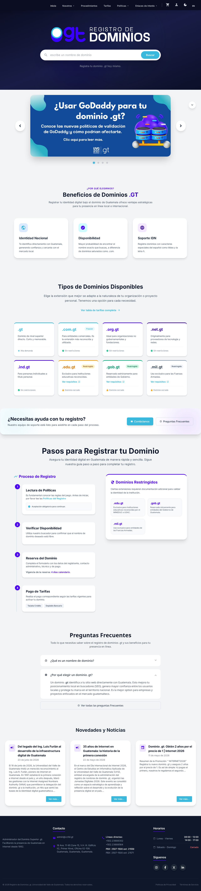
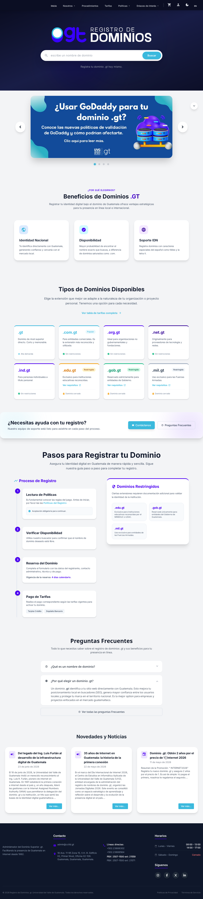
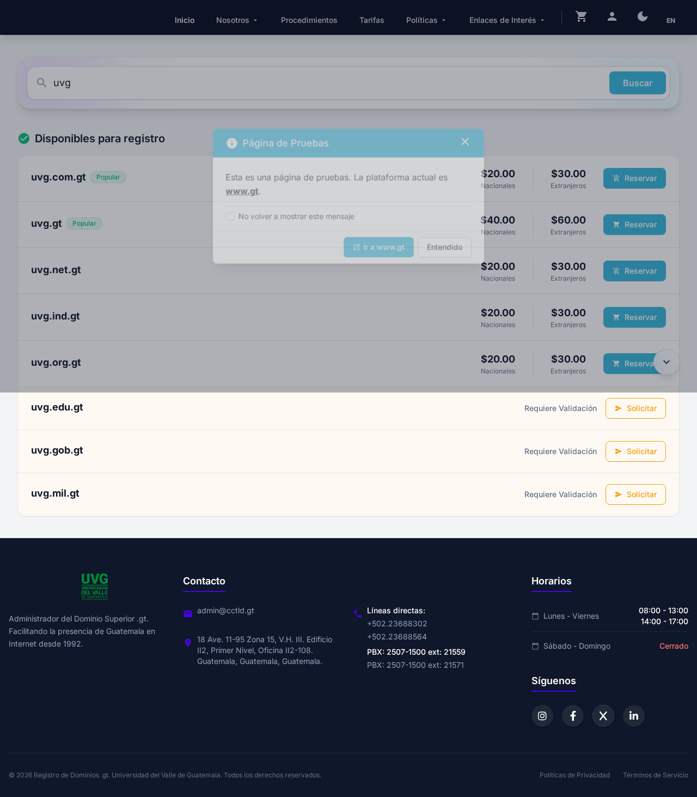
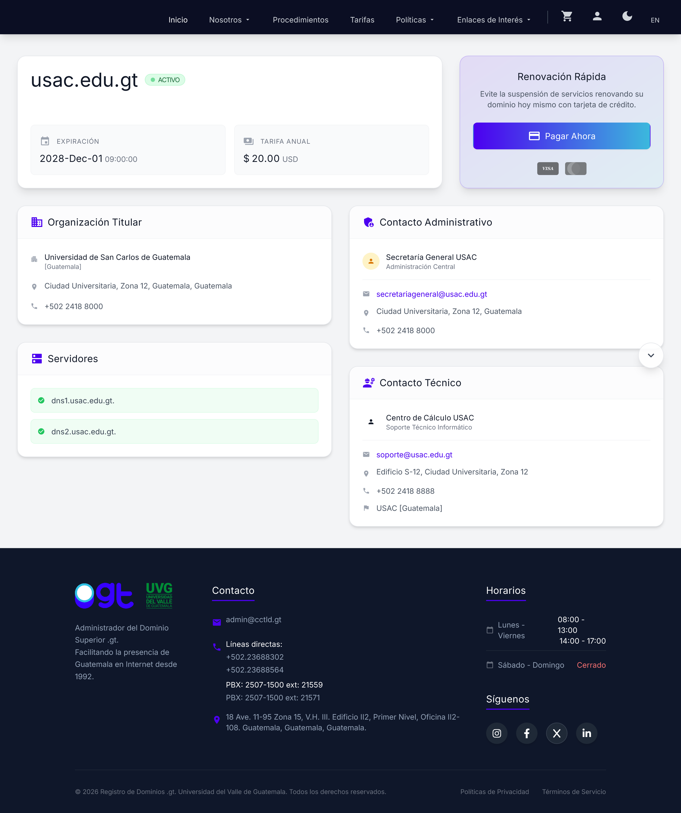
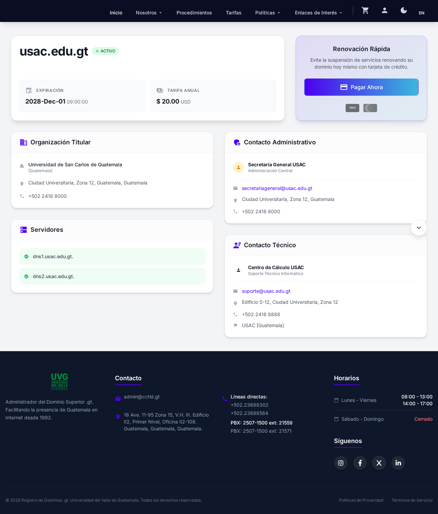
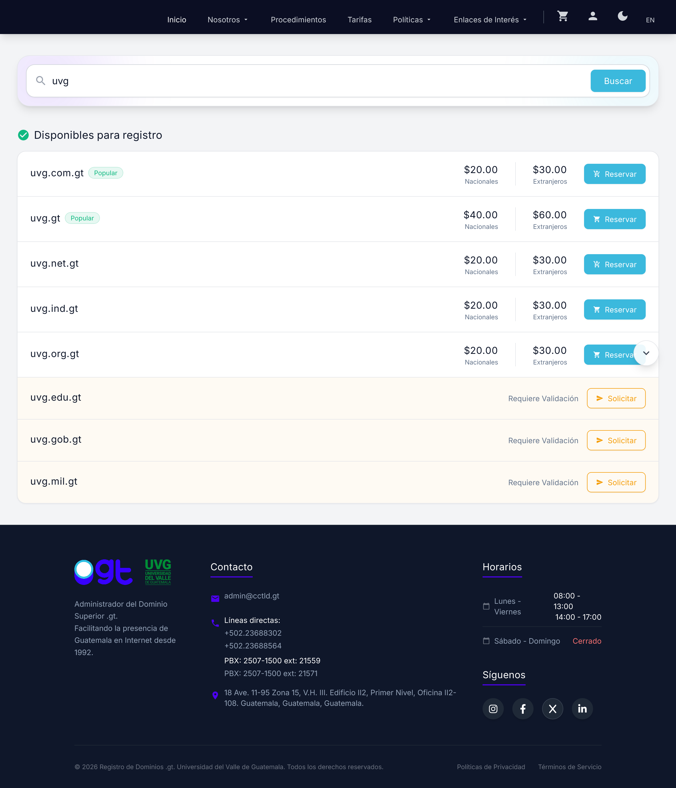
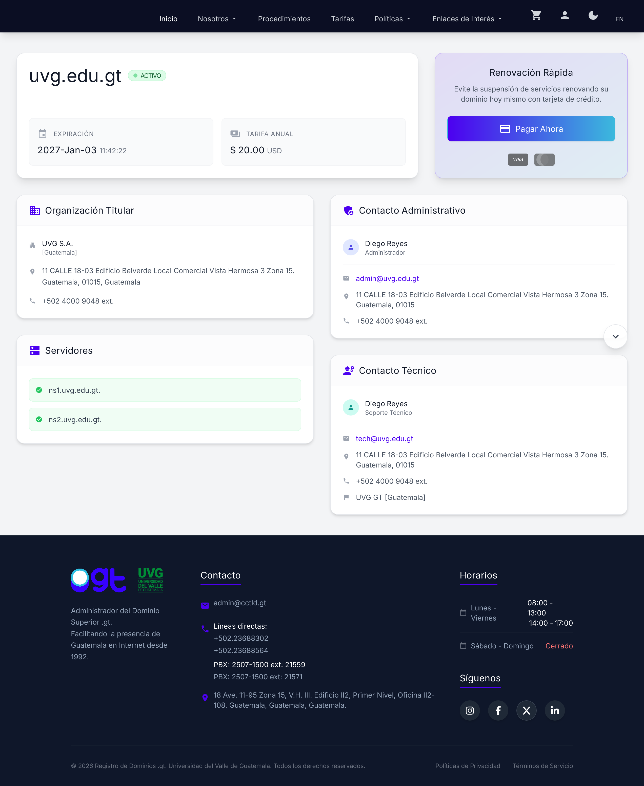

# Casos de prueba

---

# RF-1.1 — Mostrar información principal

**Requisito funcional:** El sistema debe mostrar la información principal del servicio.

**Archivo de pruebas:** `tests/pruebas.spec.js`

**Comando de ejecución:**

```bash
npx playwright test tests/pruebas.spec.js --project=chromium
```

---

## TC-01

| Campo | Detalle |
| --- | --- |
| **ID de prueba** | TC-01 |
| **Nombre** | Marco Alejandro Díaz Castañeda |
| **Requisito relacionado** | RF-1.1 |
| **Herramienta / método** | Navegar por medio de browser integrado con Playwright |
| **Precondiciones** | Tener conexión a Internet.<br>No es necesario iniciar sesión. |
| **Pasos realizados** | 1. Abrir https://dev2.registro.gt/<br>2. Esperar que cargue la página y cerrar el aviso modal "Página de Pruebas".<br>3. Verificar que exista el encabezado principal.<br>4. Verificar que exista el texto descriptivo.<br>5. Verificar que la página no esté vacía. |
| **Resultado esperado** | La información principal del servicio aparece correctamente. |
| **Resultado obtenido** | Se pudo encontrar toda la página principal: el título es "Registro de dominios .gt", el encabezado principal es visible, el cuerpo contiene el texto "Dominios" y existe al menos un enlace visible. |
| **Evidencia** | `evidencias/TC-01-informacion-principal.png` |



**Observaciones:**

- Las pruebas se ejecutan contra el portal de pruebas https://dev2.registro.gt/. Antes se usaba https://gt.nic.gt, pero ese dominio redirige a la plataforma actual (`https://www.gt/sitio/`) y desde algunas redes no permite llegar al ambiente de pruebas.
- El portal muestra un aviso modal "Página de Pruebas" (`#testPageNoticeModal`) que intercepta los clics, por lo que las pruebas lo cierran con el botón "Entendido" antes de interactuar con la página.
- Las pruebas se ejecutan con `ignoreHTTPSErrors: true` por la validación de certificados del ambiente de pruebas.
- El archivo originalmente se llamaba `tests/pruebas.js` y Playwright no lo detectaba, porque el patrón por defecto de descubrimiento es `**/*.@(spec|test).[jt]s`; se renombró a `tests/pruebas.spec.js`.

---

## TC-02

| Campo | Detalle |
| --- | --- |
| **ID de prueba** | TC-02 |
| **Nombre** | Marco Alejandro Díaz Castañeda |
| **Requisito relacionado** | RF-1.1 |
| **Herramienta / método** | Navegar por medio de browser integrado con Playwright |
| **Precondiciones** | Tener conexión a Internet.<br>No es necesario iniciar sesión. |
| **Pasos realizados** | 1. Abrir https://dev2.registro.gt/<br>2. Esperar que cargue la página y cerrar el aviso modal "Página de Pruebas".<br>3. Verificar que exista el menú de navegación principal.<br>4. Verificar que el menú incluya las secciones informativas del servicio (Inicio, Procedimientos, Tarifas, FAQ, Estadísticas) y los enlaces a las políticas de registro y de controversias.<br>5. Verificar que se muestren las líneas telefónicas y el correo de contacto en el pie de página.<br>6. Verificar que exista el carrusel informativo de la portada. |
| **Resultado esperado** | La portada expone la navegación y los datos de contacto del servicio. |
| **Resultado obtenido** | El menú principal se mostró completo con las cinco secciones informativas y los enlaces a ambas políticas; el pie de página muestra las líneas +502.23688302 y +502.23688564 junto al correo admin@cctld.gt, y el carrusel informativo es visible. |
| **Evidencia** | `evidencias/TC-02-navegacion-y-contacto.png` |



---

## TC-03

| Campo | Detalle |
| --- | --- |
| **ID de prueba** | TC-03 |
| **Nombre** | Marco Alejandro Díaz Castañeda |
| **Requisito relacionado** | RF-1.1 |
| **Herramienta / método** | Navegar por medio de browser integrado con Playwright |
| **Precondiciones** | Tener conexión a Internet.<br>No es necesario iniciar sesión. |
| **Pasos realizados** | 1. Abrir https://dev2.registro.gt/ y cerrar el aviso modal "Página de Pruebas".<br>2. Verificar que el buscador de dominios esté visible en la portada.<br>3. Escribir "uvg" en el campo de búsqueda.<br>4. Enviar el formulario de búsqueda.<br>5. Verificar que se cargue la página de resultados.<br>6. Verificar que los resultados incluyan los dominios .gt consultados.<br>7. Verificar que el buscador se conserve en la página de resultados. |
| **Resultado esperado** | El servicio principal de consulta de dominios está accesible desde la portada y devuelve resultados. |
| **Resultado obtenido** | El buscador se mostró con el marcador "escribe un nombre de dominio"; al enviar "uvg" el sitio cargó `/results/?q=uvg` con la sección "Disponibles para registro", incluyendo uvg.com.gt y uvg.edu.gt, y conservó el buscador en la página de resultados. |
| **Evidencia** | `evidencias/TC-03-buscador-dominios.png` |



---

# RF-2.2 — WHOIS de dominios registrados

**Requisito funcional:** El sistema debe mostrar la información del WHOIS para dominios que ya se encuentran registrados.

**Archivo de pruebas:** `tests/whois.spec.js`

**Comando de ejecución:**

```bash
npx playwright test tests/whois.spec.js --project=chromium
```

---

## TC-34

| Campo | Detalle |
| --- | --- |
| **ID de prueba** | TC-34 |
| **Nombre** | Marco Alejandro Díaz Castañeda |
| **Requisito relacionado** | RF-2.2 |
| **Herramienta / método** | Navegar por medio de browser integrado con Playwright |
| **Precondiciones** | Tener conexión a Internet.<br>No es necesario iniciar sesión.<br>El dominio usac.edu.gt debe existir como dominio ya registrado. |
| **Pasos realizados** | 1. Abrir https://dev2.registro.gt/<br>2. Escribir "usac" en el buscador de dominios y enviar el formulario.<br>3. Esperar que cargue la página de resultados.<br>4. Verificar que exista la sección "Dominios Registrados".<br>5. Verificar que usac.edu.gt aparezca marcado como "No disponible".<br>6. Presionar el enlace "Ver detalles..." que apunta al WHOIS del dominio.<br>7. Verificar que la vista WHOIS muestre nombre, estado y fecha de expiración. |
| **Resultado esperado** | El sistema muestra la información WHOIS del dominio ya registrado. |
| **Resultado obtenido** | El sistema mostró usac.edu.gt como no disponible y, al presionar "Ver detalles...", desplegó su ficha WHOIS con estado ACTIVO y fecha de expiración. |
| **Evidencia** | `evidencias/TC-34-whois-desde-resultados.png` |



---

## TC-35

| Campo | Detalle |
| --- | --- |
| **ID de prueba** | TC-35 |
| **Nombre** | Marco Alejandro Díaz Castañeda |
| **Requisito relacionado** | RF-2.2 |
| **Herramienta / método** | Navegar por medio de browser integrado con Playwright |
| **Precondiciones** | Tener conexión a Internet.<br>No es necesario iniciar sesión.<br>El dominio usac.edu.gt debe existir como dominio ya registrado. |
| **Pasos realizados** | 1. Abrir https://dev2.registro.gt/whois?q=usac.edu.gt<br>2. Esperar que cargue la página.<br>3. Verificar el bloque de identificación del dominio: nombre, estado, fecha de expiración y tarifa anual.<br>4. Verificar el bloque de organización titular: nombre, dirección y teléfono.<br>5. Verificar que existan al menos dos servidores de nombres.<br>6. Verificar que existan el contacto administrativo y el contacto técnico.<br>7. Verificar que no se muestre el mensaje de error. |
| **Resultado esperado** | El WHOIS muestra todos los bloques de información del dominio registrado y no muestra el mensaje de error. |
| **Resultado obtenido** | El WHOIS mostró usac.edu.gt como ACTIVO, con expiración 2028-Dec-01, tarifa $20.00 USD, titular Universidad de San Carlos de Guatemala, los servidores dns1 y dns2.usac.edu.gt, y los contactos administrativo y técnico completos. |
| **Evidencia** | `evidencias/TC-35-whois-datos-completos.png` |



---

## TC-36

| Campo | Detalle |
| --- | --- |
| **ID de prueba** | TC-36 |
| **Nombre** | Marco Alejandro Díaz Castañeda |
| **Requisito relacionado** | RF-2.2 |
| **Herramienta / método** | Navegar por medio de browser integrado con Playwright |
| **Precondiciones** | Tener conexión a Internet.<br>No es necesario iniciar sesión.<br>El dominio consultado no debe existir en el registro. |
| **Pasos realizados** | 1. Abrir https://dev2.registro.gt/results/?q=uvg<br>2. Verificar que uvg.com.gt aparezca en la sección "Disponibles para registro".<br>3. Abrir el WHOIS de ese mismo dominio: https://dev2.registro.gt/whois?q=uvg.com.gt<br>4. Revisar la información devuelta por el WHOIS. |
| **Resultado esperado** | El WHOIS solo debe mostrar información de dominios ya registrados, por lo que para un dominio disponible debería mostrarse un mensaje de error indicando que el dominio no está registrado. |
| **Resultado obtenido** | **DEFECTO:** el WHOIS devolvió una ficha completa para un dominio disponible, con estado ACTIVO, titular "UVG S.A." y servidores ns1/ns2.uvg.com.gt. Los datos parecen generarse a partir del nombre consultado; al probar con dominioinexistente12345.gt se obtuvo el titular "DOMINIOINEXISTENTE12345 S.A.". |
| **Evidencia** | `evidencias/TC-36-whois-dominio-no-registrado.png` |


---

## TC-37

| Campo | Detalle |
| --- | --- |
| **ID de prueba** | TC-37 |
| **Nombre** | Marco Alejandro Díaz Castañeda |
| **Requisito relacionado** | RF-2.2 |
| **Herramienta / método** | Navegar por medio de browser integrado con Playwright |
| **Precondiciones** | Tener conexión a Internet.<br>No es necesario iniciar sesión.<br>El dominio uvg.edu.gt debe existir en el WHOIS como dominio registrado. |
| **Pasos realizados** | 1. Abrir https://dev2.registro.gt/<br>2. Buscar "uvg" desde el buscador de dominios.<br>3. Localizar uvg.edu.gt en los resultados y revisar cómo lo clasifica el buscador.<br>4. Verificar que no se muestre la sección "Dominios Registrados" ni enlaces al WHOIS.<br>5. Consultar el WHOIS del mismo dominio: https://dev2.registro.gt/whois?q=uvg.edu.gt<br>6. Comparar el estado que reporta el buscador contra el que reporta el WHOIS. |
| **Resultado esperado** | Si el WHOIS muestra uvg.edu.gt como dominio registrado, el buscador debería listarlo dentro de "Dominios Registrados" / "No disponible" y no ofrecer el flujo de solicitud. |
| **Resultado obtenido** | **DEFECTO:** el buscador clasificó uvg.edu.gt como "Requiere Validación" y habilitó el botón "Solicitar", sin mostrar la sección "Dominios Registrados". El WHOIS del mismo dominio lo reportó ACTIVO, con titular "UVG S.A." y expiración 2027-Jan-03. Ambos módulos dan estados contradictorios. |
| **Evidencia** | `evidencias/TC-37-buscador-uvg-requiere-validacion.png`<br>`evidencias/TC-37-whois-uvg-edu-gt-activo.png` |




